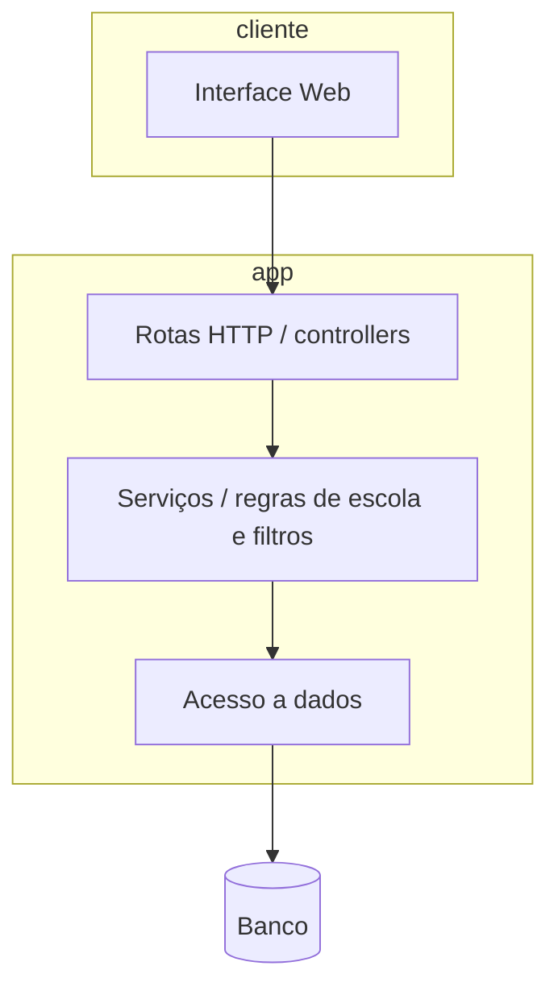

# Arquitetura (visão geral — Fase 1)

Proposta para organizar o trabalho em camadas. O desenho pode mudar se mudarmos de Node para outra stack; a ideia é separar **HTTP**, **regra de negócio** e **gravação dos dados**.

## Diagrama de camadas

Se o front ficar separado do back, o cliente vira só chamadas REST ao mesmo `API`.

## Entidades (primeira versão)

- **Escola**: dados institucionais + status da parceria + observação.
- **Contato**: pode ser coluna na escola no MVP ou tabela separada se precisarmos de mais de um contato por escola (combinar na validação).

Opcional na sprint 2: **Evento** (ou nome parecido) e vínculo escola–evento.

## Integrações

Nada obrigatório no MVP. CSV ou PDF de relatório só entra se o professor pedir e couber no cronograma.
